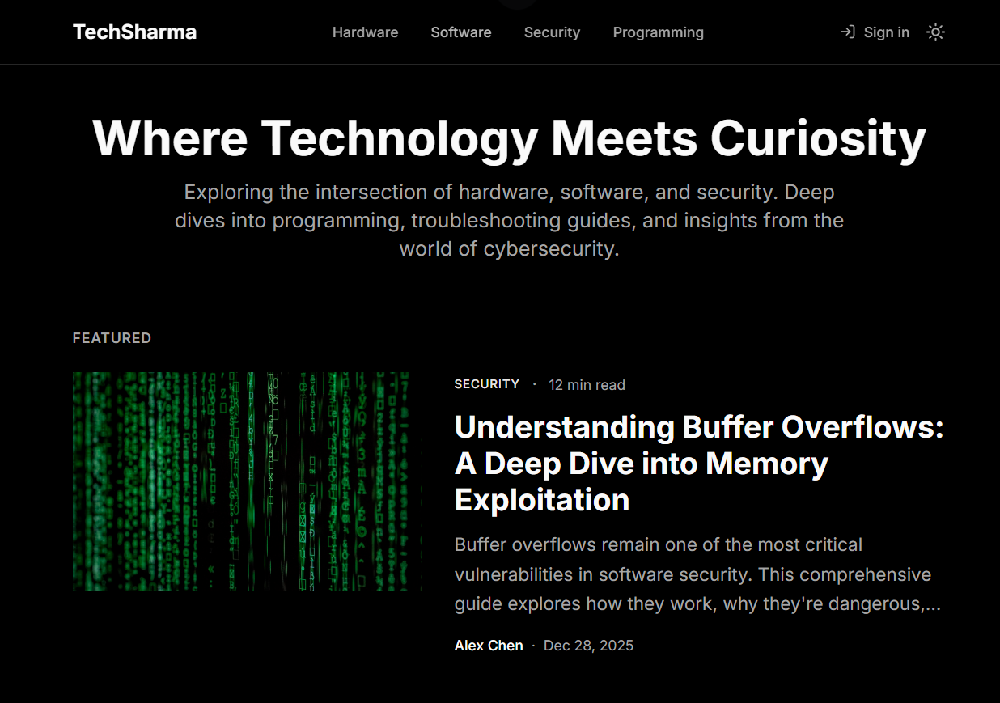
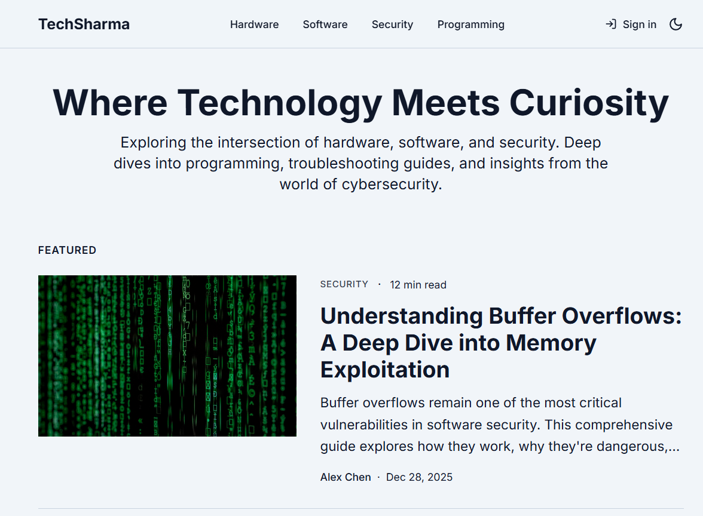
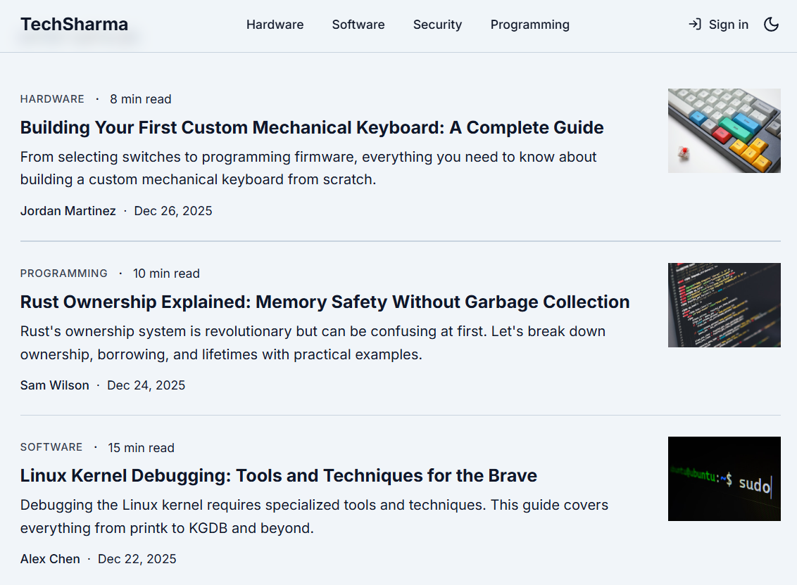

<div align="center">


<br/>

[](https://reactjs.org/)
[](https://www.typescriptlang.org/)
[](https://tailwindcss.com/)
[](https://strapi.io/)
[](https://vitejs.dev/)
[](https://postgresql.org/)

<br/>

**A beautiful, modern tech blog platform for sharing insights on hardware, software, and cybersecurity.**

<br/>

[🌐 Live Demo](#) • [🐛 Report Bug](https://github.com/Rithik-sharma12/TechSharma/issues) • [✨ Request Feature](https://github.com/Rithik-sharma12/TechSharma/issues)

<br/>

---

</div>

## 📋 Table of Contents

- [About The Project](#-about-the-project)
- [Screenshots](#-screenshots)
- [Features](#-features)
- [Tech Stack](#-tech-stack)
- [Architecture](#-architecture)
- [Getting Started](#-getting-started)
- [Configuration](#-configuration)
- [Project Structure](#-project-structure)
- [API Endpoints](#-api-endpoints)
- [Contributing](#-contributing)
- [License](#-license)
- [Contact](#-contact)

---

## 🎯 About The Project

**TechSharma** is a full-stack personal tech blog built with modern technologies. It features a sleek, Medium-inspired UI with a React frontend and Strapi headless CMS backend.

### Why TechSharma?

- 🎨 **Beautiful UI** - Clean, minimal design inspired by Medium
- 🌙 **True Dark Mode** - OLED-friendly pure black theme
- ⚡ **Blazing Fast** - Built with Vite for instant HMR
- 📱 **Fully Responsive** - Perfect on all devices
- 🔒 **Secure** - JWT authentication & protected routes
- 🚀 **Scalable** - Headless CMS architecture

---

## 📸 Screenshots

<div align="center">

### 🌙 Dark Mode (True Black)



<br/><br/>

### ☀️ Light Mode



<br/><br/>

### 📖 Article Reading Experience



</div>

<br/>

> 📌 **To add screenshots:** Place your images in the `screenshots/` folder

---

## ✨ Features

<table>
<tr>
<td width="50%">

### 📝 Content Management
- ✅ Rich Markdown article editor
- ✅ Section-based content organization
- ✅ Tag system for easy discovery
- ✅ Draft & publish workflow
- ✅ Featured articles support
- ✅ Article excerpts & read time

</td>
<td width="50%">

### 🎨 Modern UI/UX
- ✅ Clean, minimal Medium-style design
- ✅ True black OLED dark mode
- ✅ Smooth page transitions
- ✅ Reading progress indicator
- ✅ Mobile-first responsive layout
- ✅ Accessible components

</td>
</tr>
<tr>
<td width="50%">

### 🔐 Authentication & Security
- ✅ User registration & login
- ✅ JWT-based authentication
- ✅ Profile management
- ✅ Admin dashboard
- ✅ Protected API routes
- ✅ Role-based permissions

</td>
<td width="50%">

### 📚 Reader Experience
- ✅ Bookmark favorite articles
- ✅ Reading progress bar
- ✅ Syntax-highlighted code blocks
- ✅ Section-based navigation
- ✅ Related articles
- ✅ Keyboard navigation support

</td>
</tr>
</table>

---

## 🛠️ Tech Stack

### 🎨 Frontend (`code-canvas/`)

| Technology | Version | Purpose |
|:-----------|:-------:|:--------|
|  | 18.3 | UI Framework |
|  | 5.8 | Type Safety |
|  | 5.4 | Build Tool |
|  | 3.4 | Styling |
|  | Latest | Components |
|  | 5.x | Data Fetching |
|  | 6.x | Routing |

### ⚙️ Backend (`backend/`)

| Technology | Version | Purpose |
|:-----------|:-------:|:--------|
|  | 5.33 | Headless CMS |
|  | 20+ | Runtime |
|  | 16 | Database |

---

## 🏗️ Architecture

```
┌─────────────────────────────────────────────────────────────────┐
│                         CLIENT                                   │
│  ┌───────────────────────────────────────────────────────────┐  │
│  │                    React Frontend                          │  │
│  │    Vite + TypeScript + Tailwind + Shadcn/ui               │  │
│  └─────────────────────────┬─────────────────────────────────┘  │
└────────────────────────────┼────────────────────────────────────┘
                             │ REST API
                             ▼
┌─────────────────────────────────────────────────────────────────┐
│                         SERVER                                   │
│  ┌───────────────────────────────────────────────────────────┐  │
│  │                    Strapi CMS                              │  │
│  │    Content Types: Articles, Sections, Bookmarks, Ideas    │  │
│  └─────────────────────────┬─────────────────────────────────┘  │
│                             │                                    │
│  ┌─────────────────────────▼─────────────────────────────────┐  │
│  │                    PostgreSQL                              │  │
│  │               Database Storage                             │  │
│  └───────────────────────────────────────────────────────────┘  │
└─────────────────────────────────────────────────────────────────┘
```

---

## 🚀 Getting Started

### Prerequisites

Before you begin, ensure you have the following installed:

- **Node.js** `>= 20.0.0`
- **npm** `>= 10.0.0` or **bun**
- **PostgreSQL** `>= 14`
- **Git**

### Installation

1. **Clone the repository**
   ```bash
   git clone https://github.com/Rithik-sharma12/TechSharma.git
   cd TechSharma
   ```

2. **Setup Backend**
   ```bash
   cd backend
   npm install
   cp .env.example .env
   # Edit .env with your database credentials
   ```

3. **Setup Frontend**
   ```bash
   cd ../code-canvas
   npm install
   cp .env.example .env
   ```

4. **Start Backend** (Terminal 1)
   ```bash
   cd backend
   npm run dev
   ```

5. **Start Frontend** (Terminal 2)
   ```bash
   cd code-canvas
   npm run dev
   ```

6. **Access the Application**
   | Service | URL |
   |---------|-----|
   | Frontend | http://localhost:8080 |
   | Strapi Admin | http://localhost:1337/admin |
   | API | http://localhost:1337/api |

---

## ⚙️ Configuration

### Frontend Environment Variables

Create `code-canvas/.env`:

```env
# Strapi API URL
VITE_STRAPI_URL=http://localhost:1337
```

### Backend Environment Variables

Create `backend/.env`:

```env
# Server Configuration
HOST=0.0.0.0
PORT=1337

# Database Configuration
DATABASE_CLIENT=postgres
DATABASE_HOST=127.0.0.1
DATABASE_PORT=5432
DATABASE_NAME=your_database
DATABASE_USERNAME=your_username
DATABASE_PASSWORD=your_password
DATABASE_SSL=false

# Security Keys (Generate your own!)
APP_KEYS=key1,key2,key3,key4
API_TOKEN_SALT=your_api_token_salt
ADMIN_JWT_SECRET=your_admin_jwt_secret
TRANSFER_TOKEN_SALT=your_transfer_token_salt
JWT_SECRET=your_jwt_secret
```

> ⚠️ **Security Note:** Never commit `.env` files. Use `.env.example` as a template.

---

## 📁 Project Structure

```
TechSharma/
│
├── 📂 backend/                    # Strapi CMS Backend
│   ├── 📂 config/                 # Strapi configuration
│   │   ├── admin.ts
│   │   ├── api.ts
│   │   ├── database.ts
│   │   ├── middlewares.ts
│   │   ├── plugins.ts
│   │   └── server.ts
│   ├── 📂 src/
│   │   ├── 📂 api/                # Content Type APIs
│   │   │   ├── 📂 article/        # Blog articles
│   │   │   ├── 📂 bookmark/       # User bookmarks
│   │   │   ├── 📂 idea/           # Draft ideas
│   │   │   └── 📂 section/        # Content sections
│   │   └── 📂 extensions/
│   ├── .env.example
│   └── package.json
│
├── 📂 code-canvas/                # React Frontend
│   ├── 📂 public/
│   ├── 📂 src/
│   │   ├── 📂 components/
│   │   │   ├── 📂 blog/           # Blog components
│   │   │   ├── 📂 layout/         # Header, Footer
│   │   │   └── 📂 ui/             # Shadcn components
│   │   ├── 📂 contexts/           # React contexts
│   │   ├── 📂 data/               # Static data
│   │   ├── 📂 hooks/              # Custom hooks
│   │   ├── 📂 lib/                # Utilities & API
│   │   ├── 📂 pages/              # Page components
│   │   └── main.tsx
│   ├── .env.example
│   └── package.json
│
├── 📂 screenshots/                # UI Screenshots
├── .gitignore
└── README.md
```

---

## 🔌 API Endpoints

### Articles

| Method | Endpoint | Description |
|:------:|:---------|:------------|
| `GET` | `/api/articles` | Get all articles |
| `GET` | `/api/articles/:id` | Get article by ID |
| `GET` | `/api/articles?filters[slug][$eq]=:slug` | Get article by slug |
| `POST` | `/api/articles` | Create article |
| `PUT` | `/api/articles/:id` | Update article |
| `DELETE` | `/api/articles/:id` | Delete article |

### Sections

| Method | Endpoint | Description |
|:------:|:---------|:------------|
| `GET` | `/api/sections` | Get all sections |
| `GET` | `/api/sections/:id` | Get section by ID |

### Authentication

| Method | Endpoint | Description |
|:------:|:---------|:------------|
| `POST` | `/api/auth/local/register` | Register user |
| `POST` | `/api/auth/local` | Login user |
| `GET` | `/api/users/me` | Get current user |

---

## 🤝 Contributing

Contributions make the open-source community amazing! Any contributions you make are **greatly appreciated**.

1. **Fork** the Project
2. **Create** your Feature Branch
   ```bash
   git checkout -b feature/AmazingFeature
   ```
3. **Commit** your Changes
   ```bash
   git commit -m 'Add some AmazingFeature'
   ```
4. **Push** to the Branch
   ```bash
   git push origin feature/AmazingFeature
   ```
5. **Open** a Pull Request

---

## 📄 License

Distributed under the **MIT License**. See `LICENSE` for more information.

---

## 📬 Contact

<div align="center">

**Rithik Sharma**

[](https://github.com/Rithik-sharma12)
[](https://linkedin.com/in/)

<br/>

---

<br/>

### ⭐ Star this repo if you find it helpful!

<br/>


</div>
